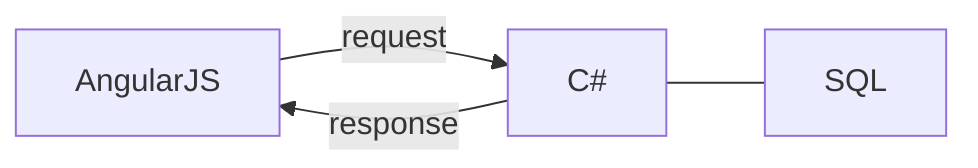

# Sistema de gerenciamento de chamados

O objetivo desta atividade é abordar todos os tipos de tecnologia necessários para o desenvolvimento de um projeto web, desde a interface com o usuário, se que se comunica com o servidor de backend, que faz a persistência de dados se conectando à um banco de dados.

Espera-se que você consiga realizar um [CRUD (Create, Read, Update, Delete)](https://www.wikiwand.com/pt/CRUD) de chamados, colocando em prática o conhecimento passado em AngularJS, C#, SQL e Git.

## Estrutura do aplicativo

### Front End

Você **DEVE** usar o framework AngularJS para montar a estrutura do front end. Caso queira usar algum framework de estilização ([Bootstrap](https://getbootstrap.com/docs/4.1/getting-started/introduction/), [Materialize](https://materializecss.com/), [FontAwesome](https://fontawesome.com) etc), você **PODE**.

### Back End

Você **DEVE** utilizar a linguagem de programação C#.

## Funcionalidades obrigatórias

### Reconhecer diferentes tipos de usuários

O sistema deve ser capaz de identificar dois tipos de usuário: **colaborador** (abre  chamados) e **atendente** (atende chamados). A interface do portal deve ser diferente nos dois casos.

### Abrir um chamado

Se o usuário logado for um  **colaborador**, o sistema deve mostrar a lista de chamados abertos por este usuário (com seus devidos statuses), além de permitir que o mesmo faça a abertura de um novo chamado.
Um chamado novo possui o status de *new*.

### Atender um chamado

Se o usuário logado for um **atendente**, o sistema deve listar todos os chamados abertos, e permitir que o usuário atenda um chamado. Ao atender o chamado, o chamado passa a ter status *inProgress*.

### Finalizar um chamado

Se o usuário logado for um **atendente**, o sistema deve permitir que chamados com o status *inProgress* possam ser finalizados, passando assim a ter status *finished* .

### Reabrir um chamado

Se o usuário logado for um **colaborador** ou um **atendente**, o sistema deve permitir que ele reabra um chamado que já foi fechado.

## Avaliação

### Front end

- Estrutura de pastas;
- Separação de responsabilidades;
- Padrão de nomenclatura de pastas, arquivos, funções e variáveis.
- Validação de erros.

### Back end

- Estrutura das rotas;
- Uso correto dos [métodos de requisição](https://www.restapitutorial.com/lessons/httpmethods.html);
- Uso correto dos [códigos de  respostas HTTP](https://httpstatuses.com/).

### Banco de dados

- Estrutura das tabelas;
- Padrão de nomenclatura das tabelas;
- Relacionamento entre tabelas.

### Versionamento

- Uso coerente do Git Flow;
- Mensagens coesas nos commits.